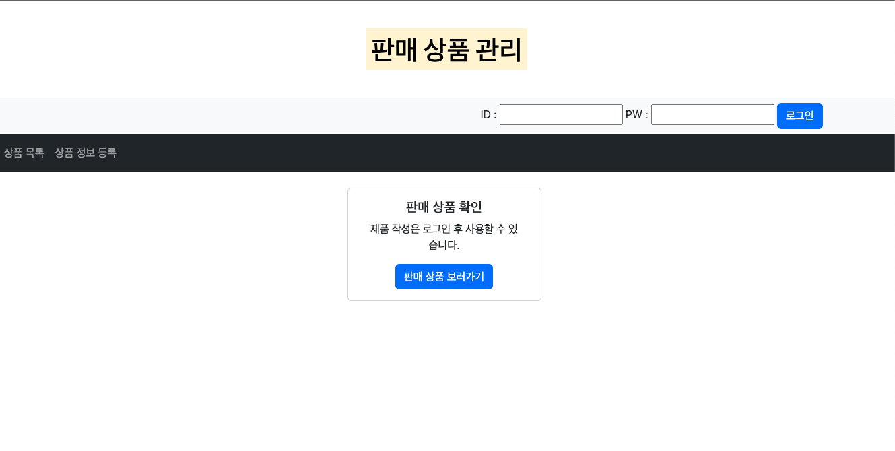
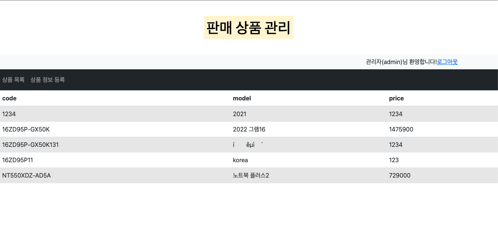
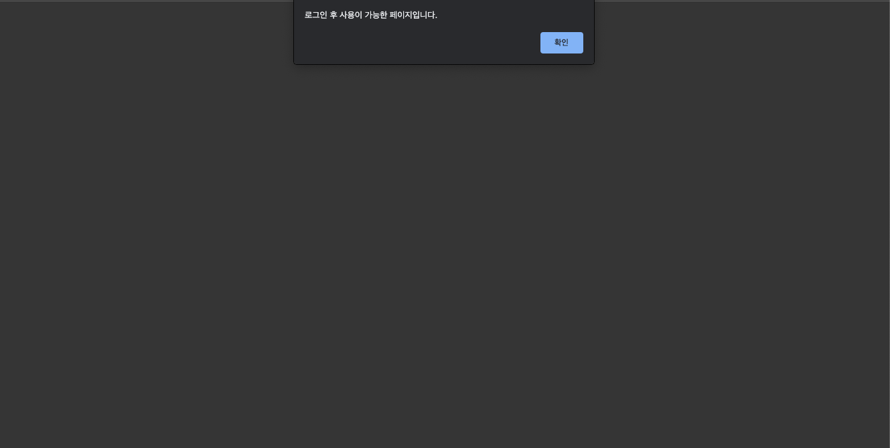
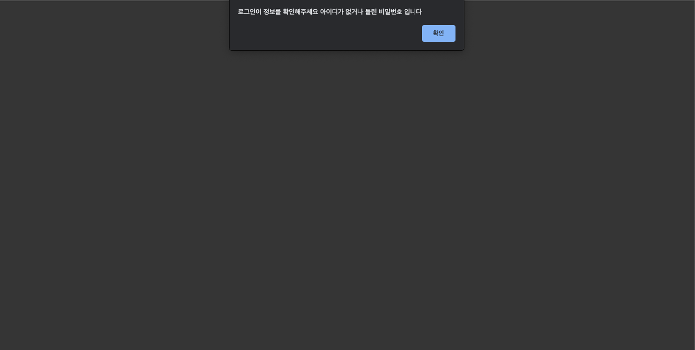
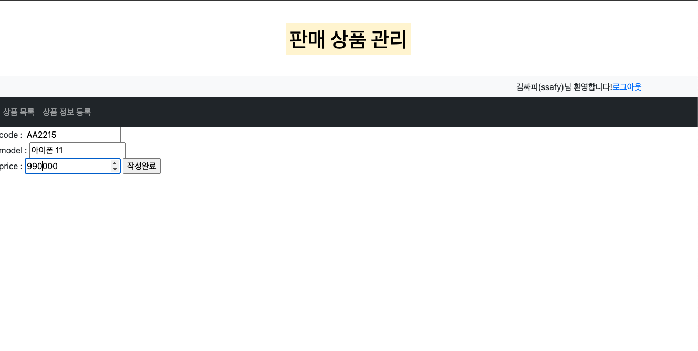

# Spring 활용한 보드

# spring-board

spring을 이용한 게시판 구현

## 🔧 Tools

> IDE : spring-tool-suite-3.9.14WAS : apache-tomcat-9.0.70
> 

## 💻 Views

> 메인 화면 (로그인 전)
> 

> 메인 화면 (로그인 후 자동으로 list를 보여줌)
> 

> 로그인하지 않고 상품 등록을 하려고하면 index페이지로 redirect
> 

> 로그인 실패 시 에러
> 

> 게시글 작성
> 

